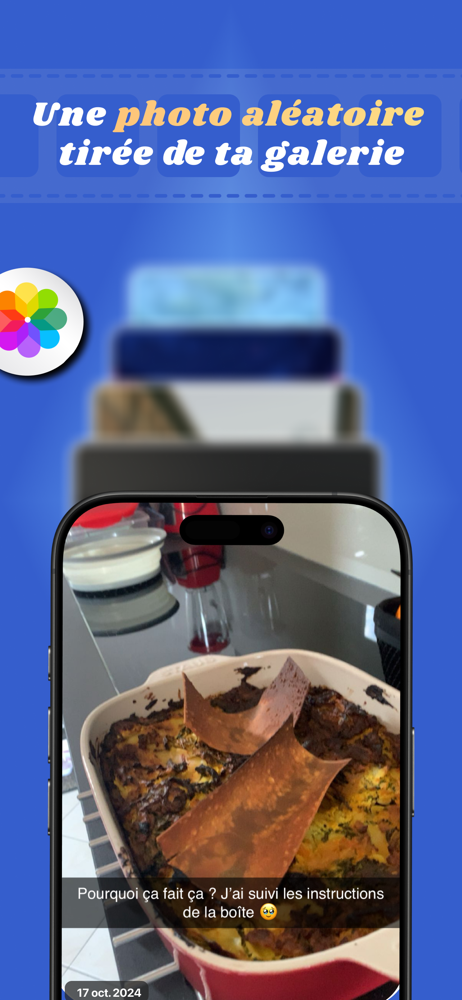
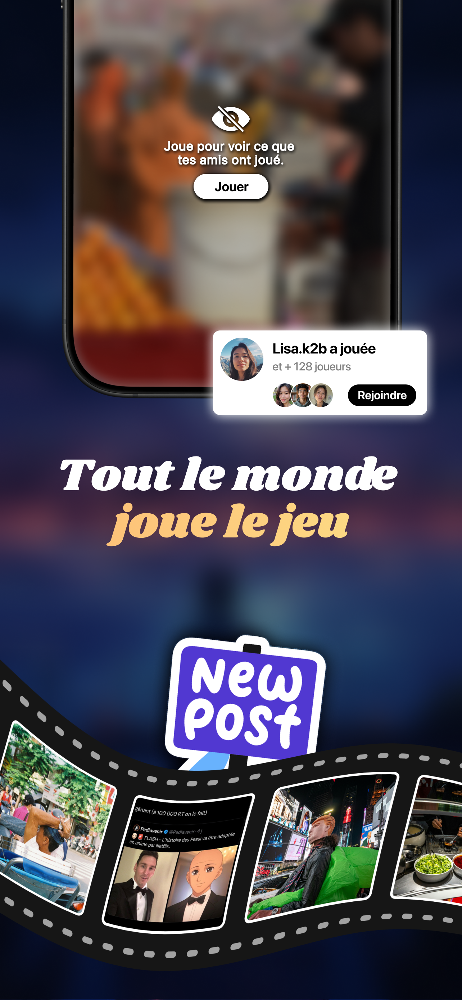

# 👋 Melric Lacoste
### **iOS Engineer** 

Building scalable, offline-first mobile applications with focus on architecture and performance.

[](https://apps.apple.com/fr/app/yakabi-daily-photo-roulette/id6744852802)
[](https://linkedin.com/in/melric-lacoste)
[](mailto:mel.lacoste.pro@gmail.com)

---

## ⚙️ Projets

### [Yakabi – Daily Photo Roulette](https://apps.apple.com/fr/app/yakabi-daily-photo-roulette/id6744852802)

**📱 Product:** Jeu social qui permet de mieux connaître ses amis. 
⏰ Chaque jour à 20h, une nouvelle partie commence !<br>
🎲 Chaque joueur participe avec une photo sélectionnée aléatoirement depuis sa pellicule.<br>
🔐 Tout le monde doit jouer le jeu pour voir ce que ses amis ont joué.

**🏗️ Technical Highlights:**
- **85-90% cache hit rate** grâce à une architecture de cache multi-niveaux (Memory + Redis + Core Data)
- **Réduction de 70%** des requêtes serveur grâce à une stratégie de cache intelligente
- **Amélioration de la latence de l'API de 25 à 30%** grâce à une couche de données GraphQL optimisée
- **Architecture distribuée** avec sharding intelligent pour des réponses à faible latence
- **Synchronisation basée sur les ETags** pour une cohérence des données à grande échelle
- **CI/CD** avec GitHub Actions & Fastlane

**🛠 Stack:**
```
iOS:      SwiftUI, UIKit, Combine, MVVM, Core Data
Backend:  Node.js, Apollo GraphQL, Redis, Firebase Cloud Functions
Services: Algolia, RevenueCat, OneSignal, Replicate AI
DevOps:   GitHub Actions, Fastlane
```

#### 📸 Screenshots
<table>
<tr>
<td></td>
<td></td>
<td></td>
<td></td>
<td></td>
</tr>
</table>

---

### [SYNapCSE]

**📱 Product:** App qui facilite la communication entre salariés et CSE.

**🏗️ Technical Highlights:**
- Mise en place d'un système de cache d'images multiniveau et d'une pagination intelligente (réduction de 45 % de la bande passante)
- Optimisation de 30 % de l'utilisation de la mémoire sur les appareils aux ressources limitées
  
**🛠 Stack:**
```
iOS:      SwiftUI, UIKit, Combine, MVVM
Backend:  Node.js, Firebase
```

---

## 🛠️ Technical Skills

**iOS Development:** Swift, SwiftUI, UIKit, Combine, Swift Concurrency, Core Data  
**Architecture:** MVVM, Clean Architecture, Offline-First, Multi-tier Caching  
**Backend:** Node.js, Apollo GraphQL, Redis, Firebase Cloud Functions
**Performance:** Instruments, XCTest, XCUITest  
**DevOps:** Git, CI/CD (GitHub Actions, Fastlane)

